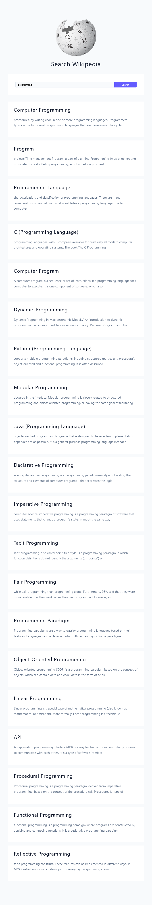

#### API DOCS

- [wiki docs](https://www.mediawiki.org/wiki/API:Main_page)

## Methodolgy

#### Initial Setup

- select form, input, results
- listen for submit events
- if empty value, display error
- create fetchPages() function to fetch data from the URL
- pass valid input value into the fetchPages() function

#### Fetch Pages

- display loading while fetching
- construct dynamic url
- display if error
- display error no items
- create renderResults()
- pass valid results into renderResults()

#### Render Results

- iterate over the list
- pull out title, snippet, pageid
- setup a card
- set results with div.articles and list inside

## Live Site

[Click here](#) to access the live site
